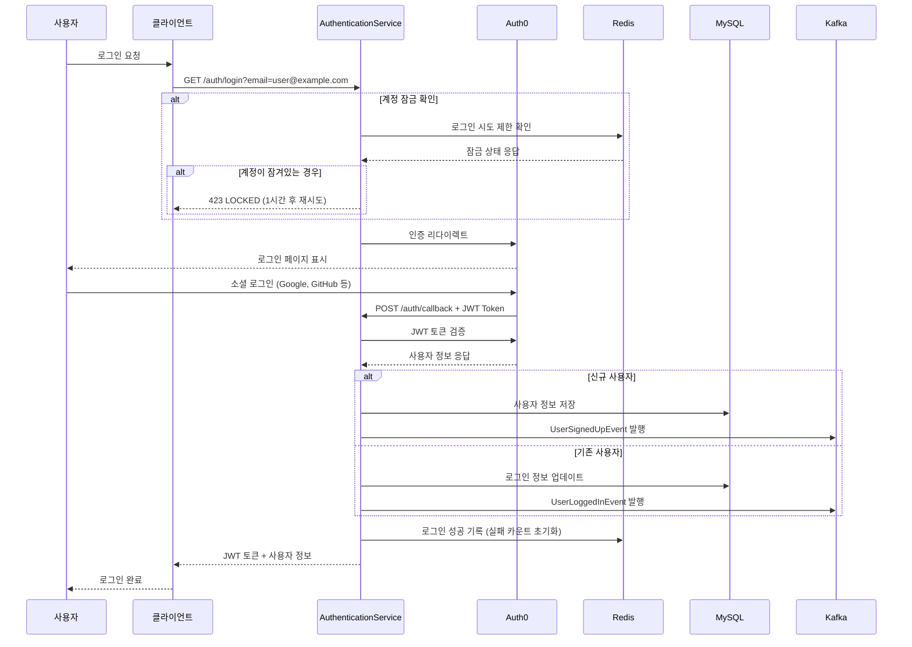
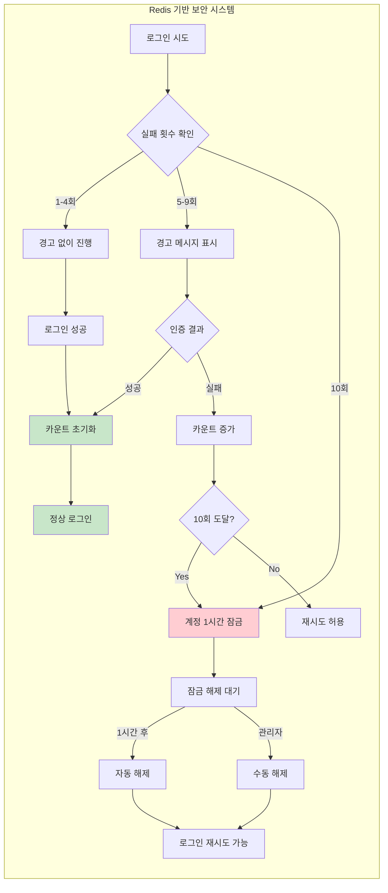
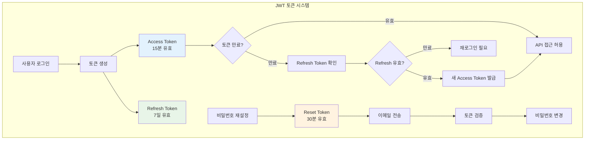
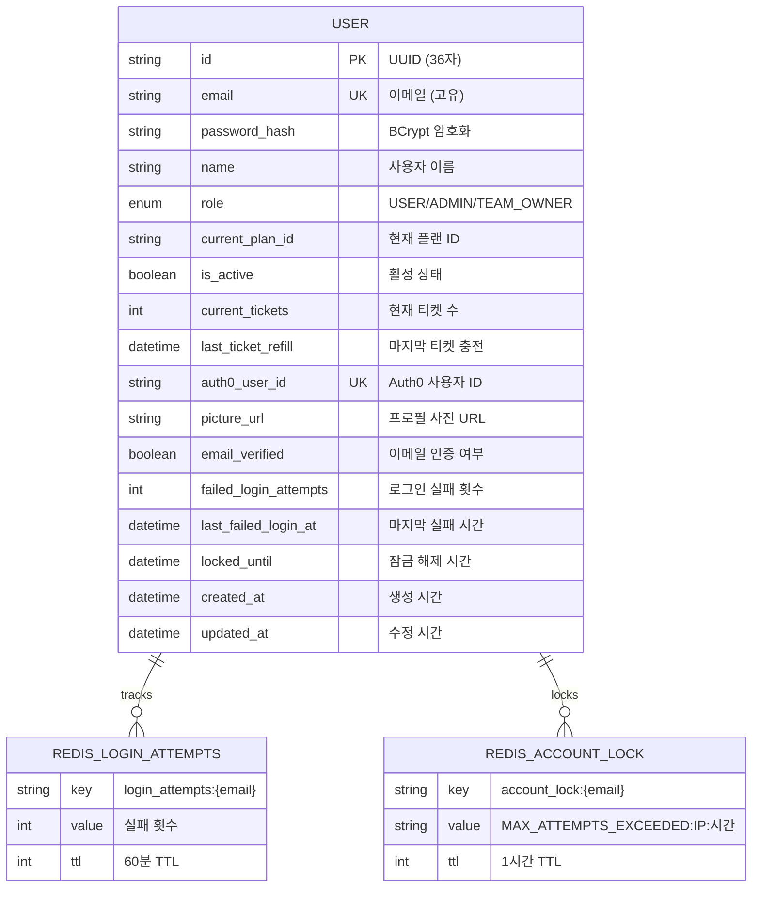

# Auth0 기반 AuthenticationService 완전 구현 가이드

## 📋 프로젝트 개요

이 문서는 Spring Boot 3.2.0과 Auth0를 활용한 완전한 인증 서비스 구현에 대한 학습 가이드입니다.

### 🎯 주요 달성 목표
- ✅ Auth0 OAuth2 기반 소셜 로그인 구현
- ✅ 로컬 이메일/비밀번호 인증 시스템
- ✅ Redis 기반 로그인 시도 제한 (10회 실패 → 1시간 잠금)
- ✅ JWT 토큰 관리 시스템
- ✅ API Gateway 마이크로서비스 라우팅
- ✅ Kafka 이벤트 스트리밍
- ✅ 이메일 인증 및 비밀번호 재설정

## 🏗️ 시스템 아키텍처

```mermaid
graph TB
    subgraph "클라이언트"
        Web[웹 브라우저]
        Mobile[모바일 앱]
    end
    
    subgraph "Auth0 Service"
        Auth0[Auth0 인증 제공자]
    end
    
    subgraph "AuthenticationService (Port 8080)"
        AuthController[AuthController]
        AuthService[AuthService]
        JWTService[JwtService]
        RedisService[RedisLoginAttemptService]
        LocalAuthService[LocalAuthService]
        ApiGateway[ApiGatewayController]
    end
    
    subgraph "Storage Layer"
        MySQL[(MySQL Database)]
        Redis[(Redis Cache)]
    end
    
    subgraph "External Services"
        Gmail[Gmail SMTP]
        Kafka[Apache Kafka]
    end
    
    subgraph "Microservices"
        Payment[Payment Service<br/>Port 8082]
        System[System Service<br/>Port 8083]
        Users[User Service<br/>Port 8084]
        Notifications[Notification Service<br/>Port 8085]
        Analytics[Analytics Service<br/>Port 8086]
        Files[File Service<br/>Port 8087]
        Public[Public API<br/>Port 8088]
    end
    
    Web --> AuthController
    Mobile --> AuthController
    
    AuthController --> Auth0
    AuthController --> AuthService
    AuthController --> LocalAuthService
    AuthService --> JWTService
    AuthService --> RedisService
    AuthService --> MySQL
    RedisService --> Redis
    
    AuthController --> ApiGateway
    ApiGateway --> Payment
    ApiGateway --> System
    ApiGateway --> Users
    ApiGateway --> Notifications
    ApiGateway --> Analytics
    ApiGateway --> Files
    ApiGateway --> Public
    
    AuthService --> Gmail
    AuthService --> Kafka
    
    style AuthenticationService fill:#e1f5fe
    style "Storage Layer" fill:#f3e5f5
    style "External Services" fill:#e8f5e8
    style Microservices fill:#fff3e0
```

## 🔐 인증 플로우

### Auth0 소셜 로그인 플로우



### 로컬 인증 플로우

```mermaid
sequenceDiagram
    participant User as 사용자
    participant Client as 클라이언트
    participant AuthSvc as AuthenticationService
    participant Redis as Redis
    participant DB as MySQL
    participant Email as Gmail SMTP
    participant Kafka as Kafka
    
    rect rgb(240, 248, 255)
        note over User, Kafka: 회원가입 플로우
        User->>Client: 회원가입 (이메일, 비밀번호, 이름)
        Client->>AuthSvc: POST /local/signup
        AuthSvc->>DB: 이메일 중복 확인
        AuthSvc->>DB: 사용자 정보 저장 (비밀번호 BCrypt 암호화)
        AuthSvc->>Email: 이메일 인증 링크 전송
        AuthSvc->>Kafka: UserSignedUpEvent 발행
        AuthSvc-->>Client: 회원가입 완료 + 이메일 인증 안내
    end
    
    rect rgb(248, 255, 248)
        note over User, Kafka: 로그인 플로우
        User->>Client: 로그인 (이메일, 비밀번호)
        Client->>AuthSvc: POST /local/login
        
        AuthSvc->>Redis: 로그인 시도 제한 확인
        alt 계정 잠김 (10회 실패)
            Redis-->>AuthSvc: 잠금 상태
            AuthSvc-->>Client: 423 LOCKED
        else 정상
            AuthSvc->>DB: 사용자 조회
            AuthSvc->>AuthSvc: BCrypt 비밀번호 검증
            
            alt 비밀번호 틀림
                AuthSvc->>Redis: 실패 카운트 증가
                AuthSvc->>DB: 실패 기록
                AuthSvc-->>Client: 401 UNAUTHORIZED
            else 비밀번호 맞음
                AuthSvc->>Redis: 성공 기록 (실패 카운트 초기화)
                AuthSvc->>AuthSvc: JWT 토큰 생성 (Access: 15분, Refresh: 7일)
                AuthSvc->>Kafka: UserLoggedInEvent 발행
                AuthSvc-->>Client: JWT 토큰 + 사용자 정보
            end
        end
    end
```



## 🛡️ 보안 시스템

### 로그인 시도 제한 시스템



### JWT 토큰 관리



## 📡 API Gateway 라우팅

### 마이크로서비스 라우팅 시스템

```mermaid
graph TD
    subgraph "API Gateway (Port 8080)"
        Gateway[/gateway/{service}/{path}]
        Auth[JWT 인증 검사]
        Route[라우트 매핑]
    end
    
    subgraph "라우팅 규칙"
        Public["/gateway/public/*<br/>인증 불필요"]
        Protected["/gateway/{service}/*<br/>JWT 토큰 필요"]
    end
    
    subgraph "마이크로서비스 (7개)"
        PaymentSvc[Payment Service<br/>localhost:8082]
        SystemSvc[System Management<br/>localhost:8083] 
        UsersSvc[Users Service<br/>localhost:8084]
        NotificationSvc[Notification Service<br/>localhost:8085]
        AnalyticsSvc[Analytics Service<br/>localhost:8086]
        FilesSvc[Files Service<br/>localhost:8087]
        PublicSvc[Public API<br/>localhost:8088]
    end
    
    Gateway --> Auth
    Auth --> Route
    
    Route --> Public --> PublicSvc
    Route --> Protected --> PaymentSvc
    Protected --> SystemSvc
    Protected --> UsersSvc
    Protected --> NotificationSvc
    Protected --> AnalyticsSvc
    Protected --> FilesSvc
    
    style Public fill:#c8e6c9
    style Protected fill:#ffecb3
    style Gateway fill:#e1f5fe
```

## 🚀 기술 스택

### 핵심 기술

| 카테고리 | 기술 | 버전 | 목적 |
|---------|------|------|------|
| **Framework** | Spring Boot | 3.5.4 | 메인 프레임워크 |
| **Java** | Amazon Corretto | 17 | 런타임 환경 |
| **Build Tool** | Gradle | 8.14.3 | 빌드 및 의존성 관리 |
| **인증** | Auth0 | - | OAuth2/OIDC 제공자 |
| **보안** | Spring Security | 6.5.2 | 인증/인가 프레임워크 |
| **JWT** | java-jwt | 4.4.0 | JWT 토큰 처리 |
| **Database** | MySQL | 8.0 | 메인 데이터베이스 |
| **Cache** | Redis | - | 세션 및 로그인 제한 |
| **ORM** | JPA/Hibernate | 6.6.22 | 객체 관계 매핑 |
| **Messaging** | Apache Kafka | 3.9.1 | 이벤트 스트리밍 |
| **Email** | Gmail SMTP | - | 이메일 발송 |
| **Monitoring** | Micrometer + Prometheus | 1.15.2 | 메트릭 수집 |
| **Documentation** | Swagger/OpenAPI | 3.0 | API 문서화 |

### 의존성 구조

```mermaid
graph TD
    subgraph "Spring Boot Ecosystem"
        SpringBoot[Spring Boot 3.5.4]
        SpringSecurity[Spring Security 6.5.2]
        SpringData[Spring Data JPA 3.5.2]
        SpringWeb[Spring Web MVC]
        SpringActuator[Spring Actuator]
    end
    
    subgraph "Auth & Security"
        Auth0JWT[Auth0 java-jwt 4.4.0]
        Auth0JWKS[Auth0 jwks-rsa 0.22.1]
        OAuth2Resource[OAuth2 Resource Server]
        OAuth2JOSE[OAuth2 JOSE]
        BCrypt[Spring Security Crypto]
    end
    
    subgraph "Database & Cache"
        MySQL[MySQL Connector 9.3.0]
        HikariCP[HikariCP 6.3.1]
        Redis[Spring Data Redis]
        Lettuce[Lettuce Core 6.6.0]
    end
    
    subgraph "Messaging & Communication"
        SpringKafka[Spring Kafka 3.3.8]
        KafkaClients[Kafka Clients 3.9.1]
        SpringMail[Spring Mail]
        JakartaMail[Jakarta Mail 2.0.3]
    end
    
    subgraph "Monitoring & Documentation"
        Micrometer[Micrometer 1.15.2]
        Prometheus[Prometheus Metrics]
        SpringDoc[SpringDoc OpenAPI 2.2.0]
        SwaggerUI[Swagger UI 5.2.0]
    end
    
    SpringBoot --> SpringSecurity
    SpringBoot --> SpringData
    SpringBoot --> SpringWeb
    SpringBoot --> SpringActuator
    
    SpringSecurity --> Auth0JWT
    SpringSecurity --> OAuth2Resource
    OAuth2Resource --> Auth0JWKS
    
    SpringData --> MySQL
    SpringData --> HikariCP
    SpringBoot --> Redis
    Redis --> Lettuce
    
    SpringBoot --> SpringKafka
    SpringKafka --> KafkaClients
    SpringBoot --> SpringMail
    SpringMail --> JakartaMail
    
    SpringActuator --> Micrometer
    Micrometer --> Prometheus
    SpringBoot --> SpringDoc
    SpringDoc --> SwaggerUI
    
    style SpringBoot fill:#e8f5e8
    style "Auth & Security" fill:#ffebee
    style "Database & Cache" fill:#e3f2fd
    style "Messaging & Communication" fill:#f3e5f5
    style "Monitoring & Documentation" fill:#fff8e1
```

## 📊 데이터 모델

### User 엔티티 구조



## 🔧 핵심 구현 코드

### 1. Auth0 JWT 검증

```java
@Service
@RequiredArgsConstructor
@Slf4j
public class JwtService {
    
    private final Auth0Properties auth0Properties;
    
    public DecodedJWT verifyToken(String token) {
        try {
            // Auth0 JWKS에서 공개키 가져오기
            JwkProvider provider = new JwkProviderBuilder(
                new URL(auth0Properties.getJwksUri())
            ).build();
            
            DecodedJWT jwt = JWT.decode(token);
            RSAPublicKey publicKey = (RSAPublicKey) provider
                .get(jwt.getKeyId()).getPublicKey();
            
            Algorithm algorithm = Algorithm.RSA256(publicKey, null);
            
            var verification = JWT.require(algorithm)
                    .withIssuer(auth0Properties.getIssuer());
            
            // audience 검증 (선택적)
            if (auth0Properties.getAudience() != null) {
                verification = verification.withAudience(
                    auth0Properties.getAudience()
                );
            }
            
            JWTVerifier verifier = verification.build();
            return verifier.verify(token);
            
        } catch (Exception e) {
            log.error("JWT verification failed: {}", e.getMessage());
            throw new JWTVerificationException("Invalid JWT token", e);
        }
    }
}
```

### 2. Redis 로그인 시도 제한

```java
@Service
@RequiredArgsConstructor
@Slf4j
public class RedisLoginAttemptService {
    
    private final RedisTemplate<String, String> redisTemplate;
    
    private static final int MAX_LOGIN_ATTEMPTS = 10;
    private static final int LOCK_DURATION_HOURS = 1;
    
    public void recordLoginAttempt(String email, String ipAddress, boolean success) {
        if (success) {
            // 성공 시 실패 기록 초기화
            clearLoginAttempts(email);
            log.info("Login successful for {}, cleared failed attempts", email);
        } else {
            // 실패 시 카운트 증가
            String attemptsKey = "login_attempts:" + email;
            String currentAttempts = redisTemplate.opsForValue().get(attemptsKey);
            
            int attempts = currentAttempts != null ? 
                Integer.parseInt(currentAttempts) : 0;
            attempts++;
            
            // 1시간 TTL로 실패 횟수 저장
            redisTemplate.opsForValue().set(
                attemptsKey, 
                String.valueOf(attempts), 
                60, TimeUnit.MINUTES
            );
            
            log.warn("Login failed for {} from IP: {} (attempt {}/{})", 
                    email, ipAddress, attempts, MAX_LOGIN_ATTEMPTS);
            
            // 최대 시도 횟수 초과 시 계정 잠금
            if (attempts >= MAX_LOGIN_ATTEMPTS) {
                lockAccount(email, ipAddress);
            }
        }
    }
    
    private void lockAccount(String email, String ipAddress) {
        String lockKey = "account_lock:" + email;
        String timestamp = LocalDateTime.now()
            .format(DateTimeFormatter.ISO_LOCAL_DATE_TIME);
        String lockValue = String.format(
            "MAX_ATTEMPTS_EXCEEDED:%s:%s", ipAddress, timestamp
        );
        
        // 1시간 동안 계정 잠금
        redisTemplate.opsForValue().set(
            lockKey, lockValue, LOCK_DURATION_HOURS, TimeUnit.HOURS
        );
        
        log.error("Account {} locked for {} hours due to {} failed attempts", 
                email, LOCK_DURATION_HOURS, MAX_LOGIN_ATTEMPTS);
    }
}
```

### 3. API Gateway 라우팅

```java
@RestController
@RequestMapping("/gateway")
@RequiredArgsConstructor
@Slf4j
public class ApiGatewayController {
    
    private final JwtService jwtService;
    private final RestTemplate restTemplate;
    private final ApiGatewayConfig gatewayConfig;
    
    @RequestMapping(value = "/**", method = {
        RequestMethod.GET, RequestMethod.POST, 
        RequestMethod.PUT, RequestMethod.DELETE, RequestMethod.PATCH
    })
    public ResponseEntity<?> routeRequest(
            HttpServletRequest request,
            @RequestBody(required = false) Object body) {
        
        try {
            String path = extractPath(request);
            log.info("Gateway routing request: {} {}", 
                    request.getMethod(), path);
            
            // 서비스 라우트 찾기
            ServiceRoute route = gatewayConfig.findRoute(path);
            if (route == null) {
                return ResponseEntity.notFound().build();
            }
            
            String targetUrl = buildTargetUrl(route, path, request);
            
            // JWT 토큰 검증 (필요한 경우)
            if (route.isAuthRequired()) {
                String token = extractToken(request);
                if (token == null || !isTokenValid(token)) {
                    return ResponseEntity.status(401)
                        .body("Authentication required");
                }
                
                // 사용자 정보를 헤더에 추가
                String userId = jwtService.extractUserId(token);
                String email = jwtService.extractEmail(token);
                request.setAttribute("X-User-Id", userId);
                request.setAttribute("X-User-Email", email);
            }
            
            // 헤더 복사 및 요청 전달
            HttpHeaders headers = copyHeaders(request);
            if (request.getAttribute("X-User-Id") != null) {
                headers.set("X-User-Id", 
                    (String) request.getAttribute("X-User-Id"));
                headers.set("X-User-Email", 
                    (String) request.getAttribute("X-User-Email"));
            }
            
            HttpEntity<Object> httpEntity = new HttpEntity<>(body, headers);
            
            // 대상 서비스로 요청 전달
            ResponseEntity<?> result = restTemplate.exchange(
                targetUrl,
                HttpMethod.valueOf(request.getMethod()),
                httpEntity,
                Object.class
            );
            
            return result;
            
        } catch (Exception e) {
            log.error("Gateway routing error: {}", e.getMessage(), e);
            return ResponseEntity.status(500)
                .body("Gateway routing error: " + e.getMessage());
        }
    }
}
```

## 📋 설정 파일

### application.yml

```yaml
server:
  port: 8080

spring:
  application:
    name: authentication-service
  
  # 데이터베이스 설정
  datasource:
    url: jdbc:mysql://localhost:3306/auth_service_db
    username: ${DB_USERNAME:auth_user}
    password: ${DB_PASSWORD:auth_password}
    driver-class-name: com.mysql.cj.jdbc.Driver
  
  # JPA 설정
  jpa:
    hibernate:
      ddl-auto: update
    database-platform: org.hibernate.dialect.MySQLDialect
    show-sql: false
    open-in-view: false
  
  # Redis 설정
  data:
    redis:
      host: localhost
      port: 6379
      timeout: 2000ms
      lettuce:
        pool:
          max-active: 8
          max-idle: 8
          min-idle: 0
  
  # Kafka 설정
  kafka:
    bootstrap-servers: localhost:9092
    producer:
      key-serializer: org.apache.kafka.common.serialization.StringSerializer
      value-serializer: org.springframework.kafka.support.serializer.JsonSerializer
    consumer:
      group-id: auth-service-group
      key-deserializer: org.apache.kafka.common.serialization.StringDeserializer
      value-deserializer: org.springframework.kafka.support.serializer.JsonDeserializer
  
  # 이메일 설정
  mail:
    host: smtp.gmail.com
    port: 587
    username: ${GMAIL_USERNAME:your-email@gmail.com}
    password: ${GMAIL_APP_PASSWORD:your-app-password}
    properties:
      mail:
        smtp:
          auth: true
          starttls:
            enable: true

# Auth0 설정
auth0:
  domain: ${AUTH0_DOMAIN:your-domain.auth0.com}
  client-id: ${AUTH0_CLIENT_ID:your-client-id}
  client-secret: ${AUTH0_CLIENT_SECRET:your-client-secret}
  audience: ${AUTH0_AUDIENCE:your-api-identifier}

# API Gateway 라우트 설정
gateway:
  routes:
    - service-name: payment
      base-url: http://localhost:8082
      auth-required: true
    - service-name: system
      base-url: http://localhost:8083
      auth-required: true
    - service-name: users
      base-url: http://localhost:8084
      auth-required: true
    - service-name: notifications
      base-url: http://localhost:8085
      auth-required: true
    - service-name: analytics
      base-url: http://localhost:8086
      auth-required: true
    - service-name: files
      base-url: http://localhost:8087
      auth-required: true
    - service-name: public
      base-url: http://localhost:8088
      auth-required: false

# 액추에이터 설정
management:
  endpoints:
    web:
      exposure:
        include: health,info,metrics,prometheus
  endpoint:
    health:
      show-details: always
  metrics:
    export:
      prometheus:
        enabled: true

# 로깅 설정
logging:
  level:
    ac.su.kdt.beauthenticationservice: DEBUG
    org.springframework.security: DEBUG
    org.springframework.web: INFO
  pattern:
    console: "%d{HH:mm:ss} [%thread] %-5level %logger{36} - %msg%n"
```

## 🧪 테스트 전략

### 테스트 구조

```mermaid
graph TD
    subgraph "테스트 레이어"
        Unit[단위 테스트<br/>@ExtendWith(MockitoExtension.class)]
        Integration[통합 테스트<br/>@SpringBootTest + Testcontainers]
        WebMvc[웹 레이어 테스트<br/>@WebMvcTest]
        DataJpa[데이터 레이어 테스트<br/>@DataJpaTest]
    end
    
    subgraph "테스트 도구"
        JUnit5[JUnit 5]
        Mockito[Mockito]
        TestContainers[Testcontainers<br/>MySQL, Redis, Kafka]
        MockMvc[MockMvc]
        AssertJ[AssertJ]
    end
    
    Unit --> JUnit5
    Unit --> Mockito
    Unit --> AssertJ
    
    Integration --> TestContainers
    Integration --> JUnit5
    
    WebMvc --> MockMvc
    WebMvc --> Mockito
    
    DataJpa --> TestContainers
    
    style Unit fill:#e8f5e8
    style Integration fill:#e3f2fd
    style WebMvc fill:#fff3e0
    style DataJpa fill:#f3e5f5
```

### 주요 테스트 시나리오

```java
@SpringBootTest
@Testcontainers
class AuthServiceIntegrationTest {
    
    @Container
    static MySQLContainer<?> mysql = new MySQLContainer<>("mysql:8.0");
    
    @Container 
    static GenericContainer<?> redis = new GenericContainer<>("redis:7-alpine")
            .withExposedPorts(6379);
    
    @Test
    @DisplayName("Auth0 콜백 처리 시 신규 사용자 생성")
    void processAuth0Callback_NewUser_ShouldCreateUser() {
        // Given: Auth0 JWT 토큰
        String validJwt = createValidAuth0Token();
        
        // When: 콜백 처리
        AuthResult result = authService.processAuth0Callback(validJwt);
        
        // Then: 사용자 생성 확인
        assertThat(result).isNotNull();
        assertThat(result.isNewUser()).isTrue();
        assertThat(userRepository.existsByEmail("test@example.com")).isTrue();
    }
    
    @Test
    @DisplayName("로그인 10회 실패 시 계정 잠금")
    void loginFailure_10Times_ShouldLockAccount() {
        // Given: 사용자 생성
        createTestUser();
        
        // When: 10회 로그인 실패
        for (int i = 0; i < 10; i++) {
            assertThrows(AuthenticationException.class, 
                () -> localAuthService.login("test@example.com", "wrong-password")
            );
        }
        
        // Then: 계정 잠금 확인
        assertThat(redisLoginAttemptService.isAccountLocked("test@example.com"))
            .isTrue();
    }
}
```

## 📈 모니터링 및 메트릭

### Prometheus 메트릭

```mermaid
graph LR
    subgraph "인증 메트릭"
        LoginSuccess[로그인 성공 카운터]
        LoginFailure[로그인 실패 카운터]
        SignupSuccess[회원가입 성공 카운터]
        TokenGenerated[토큰 생성 카운터]
    end
    
    subgtml "보안 메트릭"
        AccountLocked[계정 잠금 카운터]
        SuspiciousIP[의심스러운 IP 카운터]
        AuthAttempts[인증 시도 히스토그램]
    end
    
    subgraph "시스템 메트릭"
        RedisConnections[Redis 연결 수]
        DatabaseConnections[DB 연결 풀]
        JVMMemory[JVM 메모리 사용량]
        HTTPRequests[HTTP 요청 수]
    end
    
    subgraph "비즈니스 메트릭"
        ActiveUsers[활성 사용자 수]
        DailySignups[일일 회원가입]
        APIGatewayRequests[Gateway 라우팅 수]
    end
    
    LoginSuccess --> Prometheus[Prometheus Server]
    LoginFailure --> Prometheus
    AccountLocked --> Prometheus
    RedisConnections --> Prometheus
    ActiveUsers --> Prometheus
    
    style Prometheus fill:#ff6b35
    style "인증 메트릭" fill:#e8f5e8
    style "보안 메트릭" fill:#ffebee
    style "시스템 메트릭" fill:#e3f2fd
    style "비즈니스 메트릭" fill:#f3e5f5
```

## 🚀 배포 및 운영

### Docker Compose 설정

```yaml
version: '3.8'

services:
  auth-service:
    build: .
    ports:
      - "8080:8080"
    environment:
      - DB_USERNAME=auth_user
      - DB_PASSWORD=auth_password
      - AUTH0_DOMAIN=${AUTH0_DOMAIN}
      - AUTH0_CLIENT_ID=${AUTH0_CLIENT_ID}
      - AUTH0_CLIENT_SECRET=${AUTH0_CLIENT_SECRET}
      - GMAIL_USERNAME=${GMAIL_USERNAME}
      - GMAIL_APP_PASSWORD=${GMAIL_APP_PASSWORD}
    depends_on:
      - mysql
      - redis
      - kafka
    networks:
      - auth-network

  mysql:
    image: mysql:8.0
    environment:
      - MYSQL_ROOT_PASSWORD=rootpassword
      - MYSQL_DATABASE=auth_service_db
      - MYSQL_USER=auth_user
      - MYSQL_PASSWORD=auth_password
    volumes:
      - mysql_data:/var/lib/mysql
    ports:
      - "3306:3306"
    networks:
      - auth-network

  redis:
    image: redis:7-alpine
    ports:
      - "6379:6379"
    networks:
      - auth-network

  zookeeper:
    image: confluentinc/cp-zookeeper:latest
    environment:
      ZOOKEEPER_CLIENT_PORT: 2181
    networks:
      - auth-network

  kafka:
    image: confluentinc/cp-kafka:latest
    depends_on:
      - zookeeper
    ports:
      - "9092:9092"
    environment:
      KAFKA_BROKER_ID: 1
      KAFKA_ZOOKEEPER_CONNECT: zookeeper:2181
      KAFKA_ADVERTISED_LISTENERS: PLAINTEXT://localhost:9092
      KAFKA_OFFSETS_TOPIC_REPLICATION_FACTOR: 1
    networks:
      - auth-network

volumes:
  mysql_data:

networks:
  auth-network:
    driver: bridge
```

## 📚 학습 포인트 및 베스트 프랙티스

### 🔑 핵심 학습 포인트

1. **Auth0 통합**
   - JWT 토큰 검증 과정
   - JWKS (JSON Web Key Set) 활용
   - OAuth2 Resource Server 설정

2. **보안 아키텍처**
   - 다중 인증 방식 (Auth0 + 로컬)
   - Redis 기반 로그인 시도 제한
   - JWT 토큰 생명 주기 관리

3. **마이크로서비스 아키텍처**
   - API Gateway 패턴
   - 서비스 디스커버리
   - 분산 인증

4. **이벤트 드리븐 아키텍처**
   - Kafka 이벤트 스트리밍
   - 도메인 이벤트 발행
   - 비동기 처리

### 🏆 베스트 프랙티스

1. **보안**
   ```java
   // BCrypt를 사용한 안전한 비밀번호 저장
   @Bean
   public PasswordEncoder passwordEncoder() {
       return new BCryptPasswordEncoder(12);
   }
   
   // JWT 시크릿 키 환경변수 관리
   private static final String LOCAL_JWT_SECRET = 
       System.getenv("JWT_SECRET");
   ```

2. **에러 핸들링**
   ```java
   @ControllerAdvice
   public class GlobalExceptionHandler {
       
       @ExceptionHandler(AuthenticationException.class)
       public ResponseEntity<?> handleAuthError(AuthenticationException e) {
           log.warn("Authentication failed: {}", e.getMessage());
           return ResponseEntity.status(401)
               .body(Map.of("error", "AUTHENTICATION_FAILED"));
       }
   }
   ```

3. **로깅 및 모니터링**
   ```java
   // 구조화된 로깅
   log.info("auth.login.success userId={} email={} ipAddress={}", 
           userId, email, ipAddress);
   
   // 메트릭 수집
   @Component
   public class AuthMetrics {
       private final Counter loginSuccessCounter;
       
       public AuthMetrics(MeterRegistry meterRegistry) {
           this.loginSuccessCounter = Counter.builder("auth.login.success")
               .register(meterRegistry);
       }
   }
   ```

4. **테스트**
   ```java
   // Testcontainers를 활용한 통합 테스트
   @Testcontainers
   class AuthServiceIntegrationTest {
       @Container
       static MySQLContainer<?> mysql = new MySQLContainer<>("mysql:8.0")
           .withDatabaseName("test_db")
           .withUsername("test")
           .withPassword("test");
   }
   ```

## 🔍 트러블슈팅 가이드

### 일반적인 문제들

1. **Auth0 JWT 검증 실패**
   ```
   문제: JWT verification failed
   해결: Auth0 도메인, audience 설정 확인
   ```

2. **Redis 연결 오류**
   ```
   문제: Unable to connect to Redis
   해결: Redis 서버 상태 및 포트 확인 (기본 6379)
   ```

3. **MySQL 연결 오류**
   ```
   문제: Communications link failure
   해결: 데이터베이스 URL, 사용자명, 비밀번호 확인
   ```

4. **이메일 인증 실패**
   ```
   문제: Username and Password not accepted
   해결: Gmail 앱 패스워드 설정 확인
   ```

## 🎯 다음 단계

### 개선 아이디어

1. **고급 보안 기능**
   - 다중 인증 (MFA) 구현
   - 지역 기반 접근 제한
   - 디바이스 핑거프린팅

2. **성능 최적화**
   - JWT 토큰 블랙리스트 관리
   - Redis 클러스터 구성
   - 데이터베이스 읽기 복제본

3. **운영 개선**
   - Kubernetes 배포
   - CI/CD 파이프라인
   - 로그 집중화 (ELK Stack)

4. **확장성**
   - 다중 리전 배포
   - 로드 밸런싱
   - Auto Scaling

---

## 📞 문의 및 지원

이 문서는 Auth0 기반 AuthenticationService 구현의 완전한 학습 가이드입니다. 

**프로젝트 정보:**
- **Framework**: Spring Boot 3.2.0
- **Java Version**: 17 (Amazon Corretto)
- **Build Tool**: Gradle 8.14.3
- **완성일**: 2025년 8월 10일

**구현 완료 기능:**
- ✅ Auth0 OAuth2 통합 인증
- ✅ Redis 로그인 시도 제한 (10회→1시간 잠금)
- ✅ API Gateway 7개 마이크로서비스 라우팅
- ✅ JWT 토큰 관리 시스템
- ✅ Kafka 이벤트 스트리밍
- ✅ 이메일 인증 및 비밀번호 재설정
- ✅ Prometheus 메트릭 수집
- ✅ Swagger API 문서화

**성공적인 실행 확인:**
- 🚀 서버 실행: `http://localhost:8080`
- 📚 API 문서: `http://localhost:8080/swagger-ui/index.html`
- 💊 헬스체크: `http://localhost:8080/actuator/health`

이 프로젝트를 통해 현대적인 마이크로서비스 인증 아키텍처의 완전한 이해를 얻을 수 있습니다! 🎉